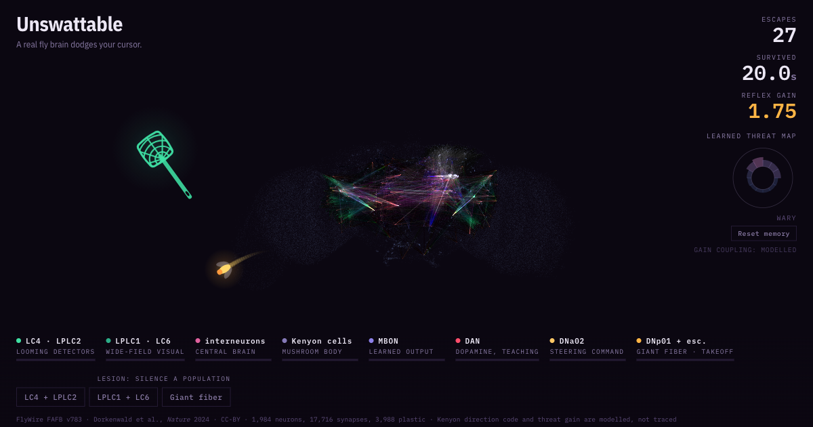

<div align="center">

# Unswattable

**A fruit fly dodges your cursor using its real connectome, 1,984 neurons
simulated live in your browser, and learns the direction you keep striking from.**

[](https://fly.manojtirukovela.com)
[](https://flywire.ai)
[](#the-circuit)
[](https://threejs.org/)
[](LICENSE)

[Play](https://fly.manojtirukovela.com) ·
[Quick start](#quick-start) ·
[The circuit](#the-circuit) ·
[How it learns](#how-it-learns) ·
[Real vs modelled](#real-vs-modelled) ·
[Deploy](#deploying)



</div>

Move your cursor at the fly. Looming detectors in its optic lobes measure how
fast you are growing on its retina, that signal converges on the giant fiber,
and the fly takes off. Everything you see firing is a real neuron with a real
name and a published paper behind it.

There is **nothing between the spikes and the movement**. No pathfinding, no
"if cornered then dodge", no difficulty script. Sensory input goes into the
connectome, descending neurons come out, and those move the fly. Silence a
population with the lesion buttons and it genuinely goes blind to you.

---

## Quick start

It fetches `flydata.json`, so it needs a server rather than opening the file
directly.

```bash
git clone git@github.com:tirukovelamanoj/unswattable.git && cd unswattable
python3 -m http.server 8000
```

Open <http://127.0.0.1:8000>. No build step, no dependencies, no install.

## Features

- **Real connectome, not a diagram.** 1,984 neurons and 17,716 synapses pulled
  from FlyWire FAFB v783, the reconstruction of a full adult fly brain, with
  real synapse counts and real excitatory or inhibitory signs from predicted
  neurotransmitters.
- **Leaky integrate-and-fire**, 18 substeps per frame, about 9ms of brain time
  per rendered frame, so the reflex runs at roughly biological speed.
- **It learns.** The mushroom body conditions on the bearing you attack from,
  using the fly's own plasticity rule.
- **Lesion controls.** Silence LC4 and LPLC2, the two neuron types that detect
  an approaching object, and it stops seeing the cursor mid-game. This is the
  honest test, and it is a button rather than a claim.
- **Efference copy.** The fly cancels the optic flow its own flight creates, so
  it can fly past a motionless cursor without panicking.
- **The whole brain rendered**, 52,000 neurons as a dim point cloud for shape,
  with the active circuit glowing inside it.

## The circuit

Seeded from the looming detectors and the descending neurons, then everything on
the path between them.

| population | role | count |
|---|---|---|
| LC4, LPLC2 | looming detectors | 314 |
| LPLC1, LC6 | wide-field visual | 265 |
| interneurons | central brain | 184 |
| Kenyon cells | mushroom body, sparse odour code | 900 |
| MBON | learned output | 96 |
| PAM, PPL1 | dopamine, the teaching signal | 150 |
| DNa02 | steering command | 2 |
| DNp01 and escape DNs | giant fiber, takeoff | 10 |

The convergence is real and strong. LC4 alone puts 1,850 synapses onto DNp04 and
757 onto DNp01, which is the giant fiber, the single most studied escape neuron
in any insect.

## How it learns

The mushroom body is the one place a fly actually learns, and biology supplies
the training rule for free.

```
 your approach bearing ──► Kenyon cells (900, about 5% fire per bearing)
                                │  KC to MBON synapse   ← the plastic site
                                ▼
                              MBON31/32 ──┤ DNa02 ──► which way it turns
                                ▲            96 GABA synapses, inhibitory
                    dopamine fires on a near miss
```

A Kenyon cell active at the same moment as dopamine has that synapse depressed.
Nothing else in the 17,716 changes, ever. The dial in the corner is drawn
directly from those 3,988 weights, not from a separate score.

Because the Kenyon code is **sparse**, only about 5% of cells fire for a given
bearing, so depressing "the cells that were just active" barely touches the other
eleven directions. That is why it conditions one bearing cleanly instead of
smearing, and it is the same reason sparse representations resist catastrophic
interference in machine learning.

### Measured

Same scripted chaser every trial, given a human reaction time of 170ms, shaky
aim, and always approaching from the upper left. 25 second cap.

| | run times (s) | median |
|---|---|---|
| naive | 0.5, 0, 15.4, 4.2, 13.6, 14.1 | 13.6 |
| after 80 strikes from the upper left | 25, 25, 25, 22.4, 21.2, 9.8 | **25.0** |

Three of six conditioned runs ran out the clock, so the true median is above the
ceiling. Six trials per arm and the naive arm swings from 0 to 15s on spawn luck,
so treat the size as soft and the direction as solid.

Conditioning is also direction specific. After 77 strikes from one bearing, the
three dial wedges covering it moved and the other nine did not:

| bearing bin | 0 | 1 | 2 | 3 to 11 |
|---|---|---|---|---|
| change | +0.86 | +0.90 | +0.80 | 0 |

> [!NOTE]
> Memory persists across rounds within a session so it can accumulate, and
> **Reset memory** restores all 3,988 synapses to their unlearned weights.

## Real vs modelled

The interesting claim is that this is real, so the boundary is worth stating
precisely. Every one of these is labelled in the source where it happens.

**Real.** Every neuron, every synapse, the synapse counts, the excitatory and
inhibitory signs, the topology, the dopamine-gated depression rule, and the
efference copy that cancels self-generated optic flow.

**Modelled.**

| | what | why |
|---|---|---|
| Receptive fields | approximated from each neuron's position in its optic lobe | real retinotopy is measured, not inferred from soma position |
| Kenyon input | driven by a direction code | real Kenyon cells encode odour, not bearing |
| Learned threat gain | learned danger raises the looming gain | no MBON in the connectome touches DNp01, so learning cannot reach the escape threshold through real wiring. It reaches steering, via MBON31/32 onto DNa02, and that alone is too subtle to feel |
| Flight | speed, drag, saccade timing | tuned game physics, downstream of the brain's decision |

> [!IMPORTANT]
> The line between real and tuned runs exactly at the descending neurons. The
> brain decides **when** to escape and biases **which way**. How fast the fly
> then flies is game code.

## Deploying

Three static files, no build step: `index.html`, `flydata.json`, `og.png`.

Deployed on Vercel. No configuration file and no build step: import the repo,
framework preset **Other**, leave the build command empty, output directory is
the repo root.

For the custom domain, add it in the Vercel project and point a CNAME at it from
wherever DNS lives:

| record | value |
|---|---|
| `fly` CNAME | `cname.vercel-dns.com` |

Any static host works equally well. The one thing to check before picking one is
whether it can attach a custom domain without taking over the whole DNS zone.
Cloudflare Workers cannot, which rules it out if your DNS lives elsewhere.

> [!WARNING]
> `og:image`, `twitter:image` and `og:url` are absolute against
> `fly.manojtirukovela.com`. Change them if the domain moves, or link previews
> will point at the old host.

A container would be the wrong shape here. The simulation runs entirely in the
visitor's browser, so there is no server state, no server compute, and nothing
to keep warm.

## Rebuilding the data

`flydata.json` is generated, not hand-made.

```bash
uv run --with pandas --with numpy python build_data.py
```

It needs two inputs, both public and free:

| file | source |
|---|---|
| `Supplemental_file1_neuron_annotations.tsv` | [flyconnectome/flywire_annotations](https://github.com/flyconnectome/flywire_annotations) |
| `connections_783.csv.gz` | `storage.googleapis.com/flywire-data/codex/data/fafb/783/connections.csv.gz` |

The script selects the circuit, keeps one hemisphere of the mushroom body to
hold the simulation cost down, assigns Kenyon bearings from a seeded RNG so the
code is stable between builds, and packs everything as base64 typed arrays.

## Credits

Connectome data is FlyWire FAFB v783, [Dorkenwald et al., *Nature* 2024](https://doi.org/10.1038/s41586-024-07558-y)
and [Schlegel et al., *Nature* 2024](https://doi.org/10.1038/s41586-024-07686-5),
used under CC-BY.

> [!NOTE]
> MIT in `LICENSE` covers the code. The connectome data carries its own CC-BY
> licence with an attribution requirement, which is met in the page footer and
> here. The two are not the same licence.
